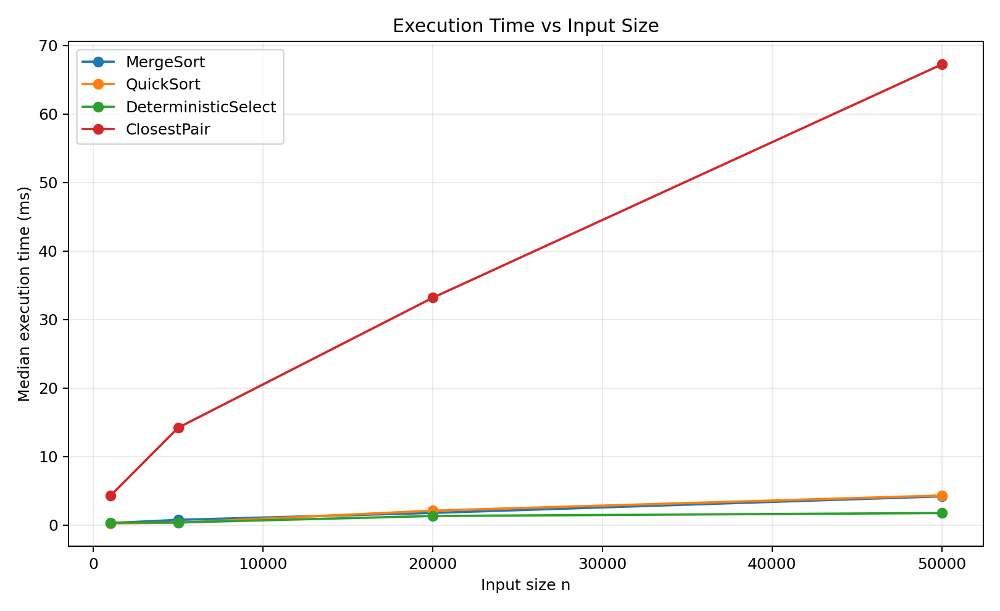
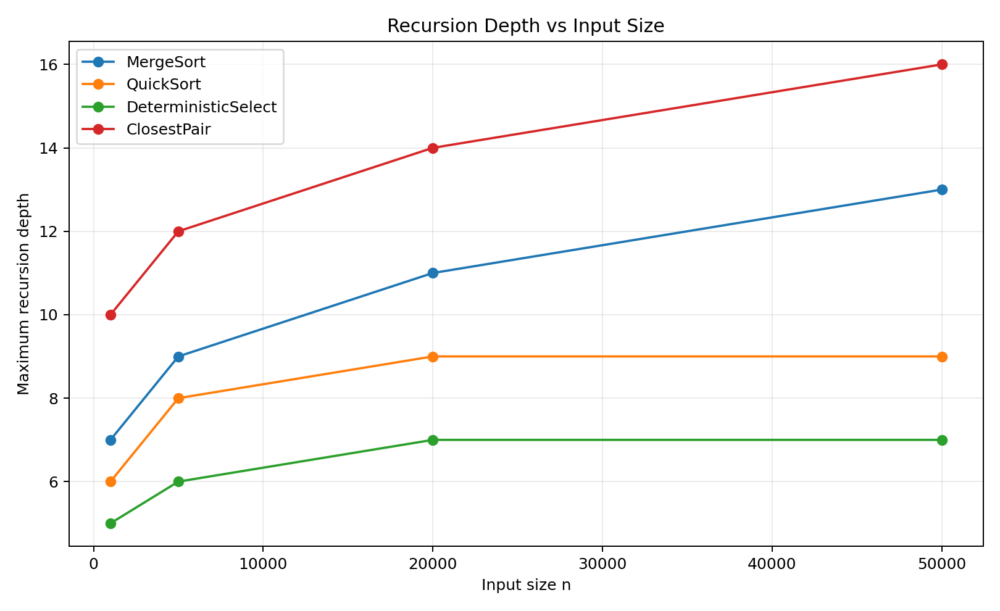
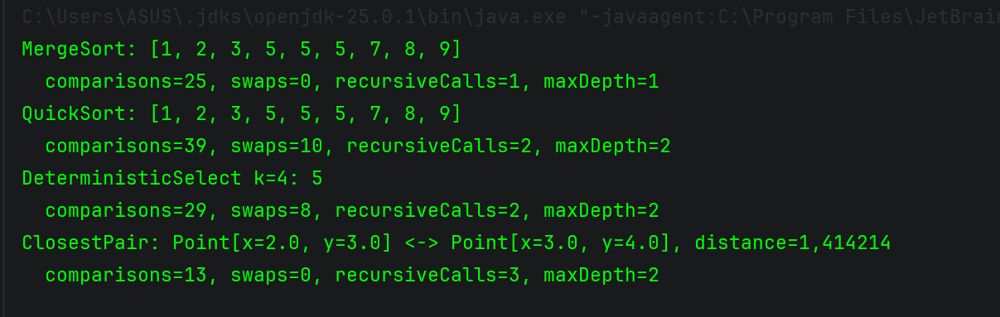
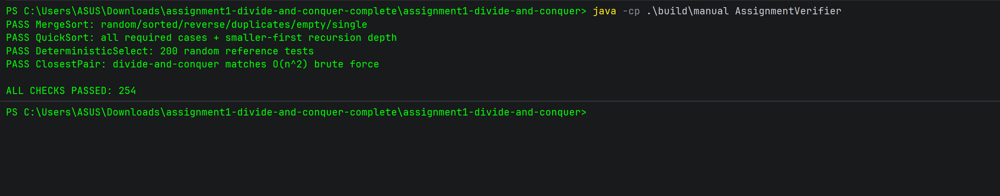
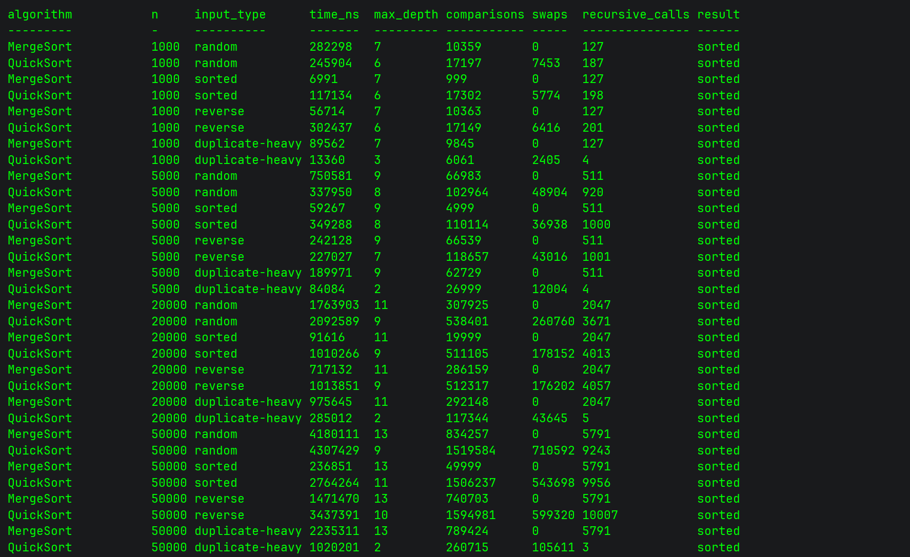

# Assignment 1: Divide-and-Conquer Algorithm Analysis

## A. Project Overview

This project implements, tests, measures, and analyzes four classic divide-and-conquer algorithms in Java:

1. **MergeSort** — linear merge, one reusable auxiliary buffer, and insertion-sort cutoff for small subarrays.
2. **Randomized QuickSort** — randomized pivot, in-place three-way partitioning, and smaller-first recursion with iteration over the larger side.
3. **Deterministic Select (Median-of-Medians)** — groups of five, median-of-medians pivot, in-place partitioning, and selection only in the required partition.
4. **Closest Pair of Points** — points sorted by x-coordinate, recursive divide-and-conquer, and a y-ordered strip check.

The program also records execution time, maximum recursion depth, comparisons, swaps, and recursive calls. Experimental results are written to results/results.csv and visualized in docs/plots/.

---

# B. Algorithm Analysis

## 1. MergeSort

### How it works

MergeSort recursively divides the array into two halves, sorts both halves, and merges them in linear time. This implementation allocates one auxiliary buffer once and reuses it for every merge. Small subarrays use insertion sort with a cutoff of 24 elements. If the largest element of the left half is already less than or equal to the smallest element of the right half, the merge step is skipped.

### Recurrence

For normal recursive levels:

T(n) = 2T(n/2) + Θ(n)

Using the Master Theorem:

a = 2
b = 2
f(n) = Θ(n)
n^(log_b a) = n

Therefore:

T(n) = Θ(n log n)

### Complexity

- Time: **Θ(n log n)** in the general case.
- Extra space: **Θ(n)** for the reusable buffer plus **O(log n)** recursion stack.
---

## 2. Randomized QuickSort

### How it works

A pivot is chosen randomly inside the current range. Three-way in-place partitioning creates three areas: values smaller than the pivot, values equal to the pivot, and values greater than the pivot. The algorithm recursively processes only the smaller outside partition and continues iteratively with the larger partition.

The three-way partition is especially useful for duplicate-heavy data because all values equal to the pivot are completed in one partitioning step.

### Recurrence

A partition around pivot position `k` gives:

T(n) = T(k) + T(n-k-1) + Θ(n)

For reasonably balanced randomized partitions, the expected behavior is approximately:

T(n) ≈ 2T(n/2) + Θ(n) = Θ(n log n)

The worst case is a sequence of extremely unbalanced partitions:

T(n) = T(n-1) + Θ(n) = Θ(n²)

### Complexity

- Expected time: **Θ(n log n)**.
- Worst-case time: **O(n²)**.
- Extra array space: **O(1)** because partitioning is in-place.
- Stack space: **O(log n)** because only the smaller partition is entered recursively.

### Why smaller-first recursion limits stack depth

If the recursive call always receives the smaller partition, the recursively processed partition contains at most half of the elements of the current range. Therefore the size along the call stack decreases at least geometrically: `n, n/2, n/4, ...`. The larger side is processed by the `while` loop and does not create another stack frame. This does not remove QuickSort's `O(n²)` worst-case running time, but it prevents linear recursion depth.

---

## 3. Deterministic Select (Median-of-Medians)

### How it works

The array is divided into groups of at most five elements. Each group is sorted locally and its median is moved to the front region of the array. The median of these medians becomes the pivot. After an in-place three-way partition, the algorithm continues only in the partition that can contain rank `k`.

### Recurrence and Akra-Bazzi intuition

Grouping by five guarantees that the pivot cannot be arbitrarily bad. A constant fraction of elements is guaranteed to lie on both sides of the pivot. A standard upper-bound recurrence is:

T(n) ≤ T(n/5) + T(7n/10 + O(1)) + Θ(n)

The two recursive fractions sum to less than 1:

1/5 + 7/10 = 9/10

The remaining work is linear. The Akra-Bazzi-style intuition is that every level eliminates a fixed fraction of the remaining problem, so the total amount of work forms a convergent linear series. Therefore:

T(n) = Θ(n)

### Complexity

- Worst-case time: **Θ(n)**.
- Extra array space: **O(1)** apart from recursion stack.
- Stack depth: **O(log n)** for the median-of-medians recursion.

---

## 4. Closest Pair of Points

### How it works

The input points are sorted by x-coordinate and also maintained in y-order. The recursive algorithm divides the points around the middle x-coordinate, solves the left and right halves, and sets `delta` to the smaller distance found. It then creates a vertical strip of points whose x-distance from the dividing line is below `delta`. Because the strip is already in y-order, only nearby candidates need to be checked before the y-distance is at least `delta`.

### Recurrence

The two half-size recursive problems plus linear split/strip processing give:

T(n) = 2T(n/2) + Θ(n)

By the Master Theorem:

T(n) = Θ(n log n)

### Complexity

- Time: **Θ(n log n)**.
- Peak auxiliary memory: **O(n)** in this implementation.
- The reference brute-force method takes **Θ(n²)** and is used only for correctness checking on small inputs.

---

# C. Experimental Results

## Method

The experiments use `System.nanoTime()`. Input sizes are `1,000`, `5,000`, `20,000`, and `50,000`. Sorting algorithms are tested with random, sorted, reverse-sorted, and duplicate-heavy arrays. Selection and Closest Pair use random inputs.

To reduce JVM startup/JIT noise, each benchmark performs one untimed warm-up and then records the **median of three measured runs**. The complete raw data is in [`results/results.csv`](results/results.csv).

## Random-input results

| Algorithm | n | Median time (ms) | Max recursion depth | Comparisons |
|---|---:|---:|---:|---:|
| MergeSort | 1,000 | 0.282 | 7 | 10,359 |
| MergeSort | 5,000 | 0.751 | 9 | 66,983 |
| MergeSort | 20,000 | 1.764 | 11 | 307,925 |
| MergeSort | 50,000 | 4.180 | 13 | 834,257 |
| QuickSort | 1,000 | 0.246 | 6 | 17,197 |
| QuickSort | 5,000 | 0.338 | 8 | 102,964 |
| QuickSort | 20,000 | 2.093 | 9 | 538,401 |
| QuickSort | 50,000 | 4.307 | 9 | 1,519,584 |
| Deterministic Select | 1,000 | 0.351 | 5 | 9,447 |
| Deterministic Select | 5,000 | 0.367 | 6 | 46,333 |
| Deterministic Select | 20,000 | 1.315 | 7 | 199,602 |
| Deterministic Select | 50,000 | 1.747 | 7 | 503,276 |
| Closest Pair | 1,000 | 4.257 | 10 | 13,077 |
| Closest Pair | 5,000 | 14.203 | 12 | 80,088 |
| Closest Pair | 20,000 | 33.172 | 14 | 373,303 |
| Closest Pair | 50,000 | 67.235 | 16 | 1,001,061 |

## Effect of input structure at n = 50,000

| Algorithm | Random (ms) | Sorted (ms) | Reverse (ms) | Duplicate-heavy (ms) |
|---|---:|---:|---:|---:|
| MergeSort | 4.180 | 0.237 | 1.471 | 2.235 |
| QuickSort | 4.307 | 2.764 | 3.437 | 1.020 |

The MergeSort implementation is particularly fast on sorted input because the boundary check detects already ordered halves and skips most merges. Randomized QuickSort is not destroyed by sorted/reverse input because its pivot does not depend on the first or last element. Duplicate-heavy QuickSort is faster because the three-way partition groups many equal values at once.

## Plot 1 — Time vs. n

## Plot 2 — Recursion depth vs. n

---

# D. Discussion

## Do the results match theoretical complexity?

Yes, at the scale of these experiments the overall growth matches the expected trends. MergeSort and Closest Pair show increasing cost consistent with `n log n`. Deterministic Select grows much closer to linear than a full sort because only one relevant partition is followed. QuickSort also behaves approximately like `n log n` on ordinary inputs, while the exact measured times vary because its randomized pivots produce different partition shapes.

Runtime measurements are not exact mathematical proofs. Constant factors, the Java runtime, memory allocation, and the machine's current load can easily make one individual measurement non-monotonic, especially for small inputs.

## How does input structure affect performance?

MergeSort has the same asymptotic bound regardless of input order, but the implementation's already-sorted merge check makes sorted data much cheaper in practice. Reverse and random arrays require more real merging.

Randomized QuickSort avoids the classic first-pivot problem on already sorted arrays. The three-way partition gives a strong practical advantage on duplicate-heavy arrays because the equal region does not need to be processed recursively.

## Why does smaller-first recursion help QuickSort?

Only the smaller partition creates a recursive call. Since the smaller side contains at most half of the current elements, recursive stack sizes decrease geometrically. The larger side is processed by iteration. This keeps stack usage `O(log n)` even when the total amount of partition work becomes unfavorable.

## Why does Median-of-Medians guarantee O(n)?

Groups of five produce a pivot with a guaranteed quality: a constant fraction of elements must be no larger than the pivot, and another constant fraction must be no smaller. Therefore each selection step discards a fixed fraction of the current problem. Combined with linear partition work, the recurrence resolves to `Θ(n)` in the worst case.

## Why is divide-and-conquer Closest Pair faster than O(n²) for large inputs?

Brute force compares every pair of points, so the number of comparisons grows quadratically. Divide-and-conquer reduces the problem to two half-size subproblems and then performs a linear strip pass. The resulting `Θ(n log n)` growth is substantially better as `n` becomes large.

## What practical factors affect performance?

Several practical effects influence measured Java performance:

- **JIT compilation:** HotSpot can optimize methods after they have executed several times.
- **JVM warm-up:** the earliest invocation may be slower than later ones.
- **CPU caches:** contiguous integer arrays are often more cache-friendly than object-heavy point structures.
- **Garbage collection:** temporary objects/lists can occasionally create pauses.
- **Allocation overhead:** Closest Pair uses temporary lists and sets during recursive splitting.
- **Branch prediction:** sorted, random, reverse, and duplicate-heavy inputs create different branch patterns.
- **System load:** other processes can affect nanosecond-level timings.

---

# E. Reflection

This assignment showed that implementing a divide-and-conquer algorithm is only part of the work; the recursion strategy and data movement can be just as important as the high-level recurrence. The most useful example was QuickSort: choosing random pivots improves typical partition quality, while recursing only on the smaller side solves a different problem—stack growth. Median-of-Medians was also important because it demonstrates how a carefully chosen pivot can turn selection from an expected-time idea into a worst-case linear-time guarantee.

The main implementation challenges were correctly handling duplicates, measuring recursion depth without changing the algorithm's behavior, and keeping Closest Pair at `O(n log n)` instead of accidentally re-sorting every recursive strip. Testing against trusted reference methods (`Arrays.sort()`, sorted rank lookup, and brute-force point comparison) made it much easier to catch errors before running performance experiments.

---

# F. Screenshots

## Program output

## Test results

## Experimental results excerpt

